## Python Level Test

[1번 코드](https://github.com/LikeLionSCH/8th-Python-HW/blob/master/Level_Test_[06.21]/0621_Level_Test_1.py)
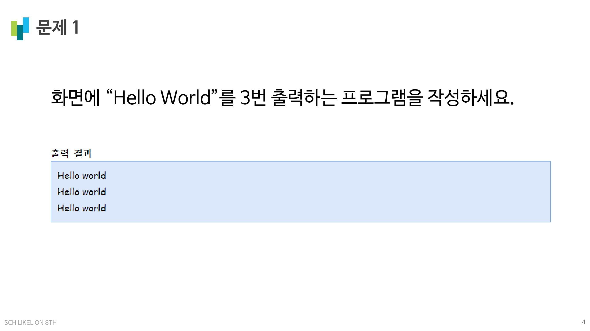

[2번 코드](https://github.com/LikeLionSCH/8th-Python-HW/blob/master/Level_Test_[06.21]/0621_Level_Test_2.py)
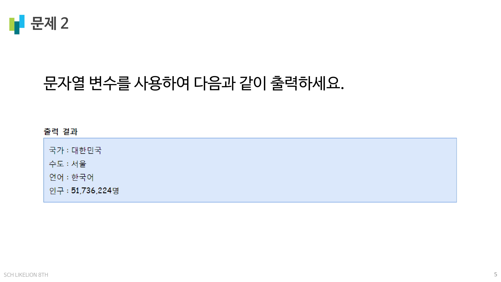

[3번 코드](https://github.com/LikeLionSCH/8th-Python-HW/blob/master/Level_Test_[06.21]/0621_Level_Test_3.py)
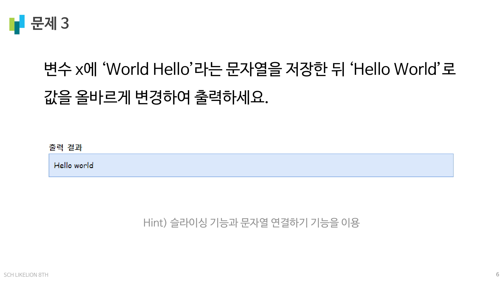

[4번 코드](https://github.com/LikeLionSCH/8th-Python-HW/blob/master/Level_Test_[06.21]/0621_Level_Test_4.py)
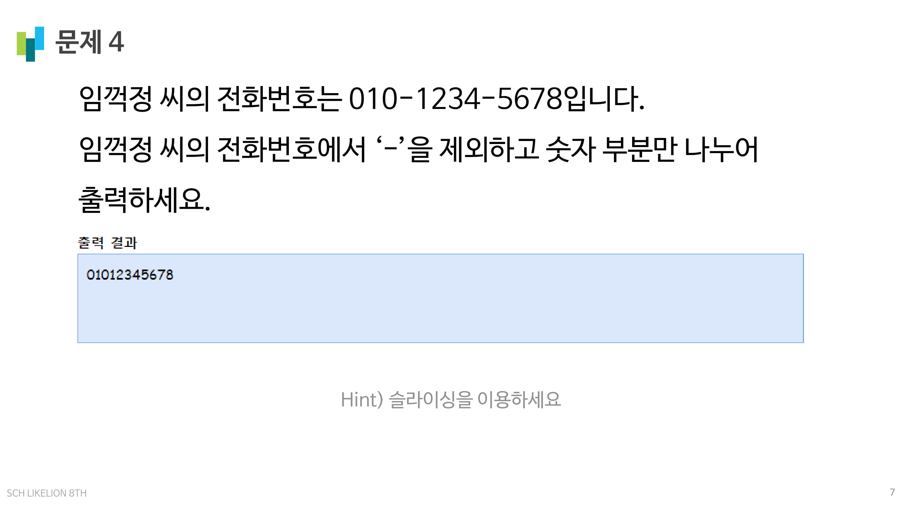

[5번 코드](https://github.com/LikeLionSCH/8th-Python-HW/blob/master/Level_Test_[06.21]/0621_Level_Test_5.py)
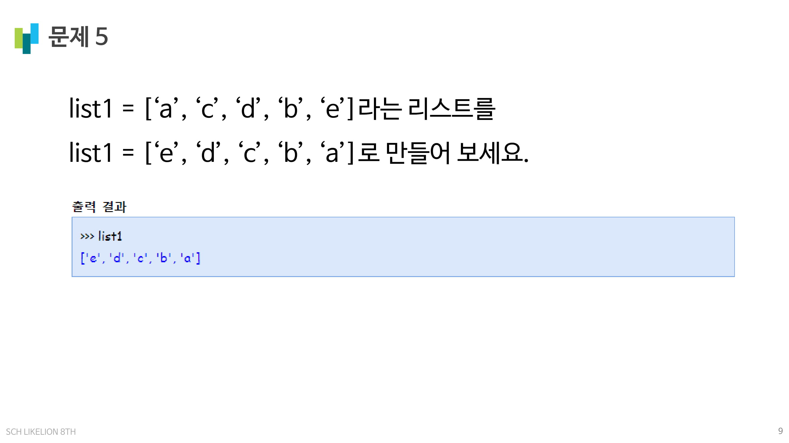

[6번 코드](https://github.com/LikeLionSCH/8th-Python-HW/blob/master/Level_Test_[06.21]/0621_Level_Test_6.py)

[7번 코드](https://github.com/LikeLionSCH/8th-Python-HW/blob/master/Level_Test_[06.21]/0621_Level_Test_7.py)
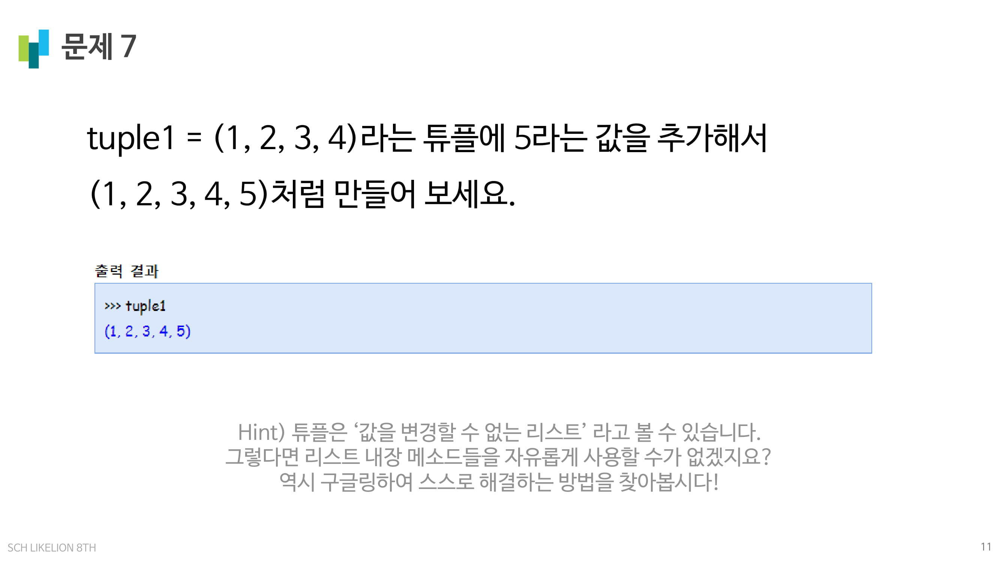

[8번 코드](https://github.com/LikeLionSCH/8th-Python-HW/blob/master/Level_Test_[06.21]/0621_Level_Test_8.py)
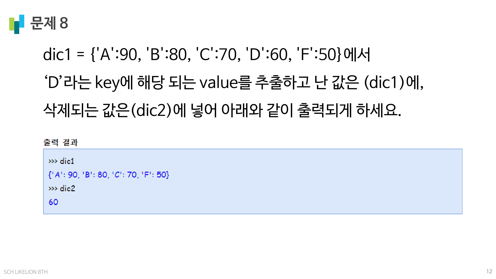

[9번 코드](https://github.com/LikeLionSCH/8th-Python-HW/blob/master/Level_Test_[06.21]/0621_Level_Test_9.py)
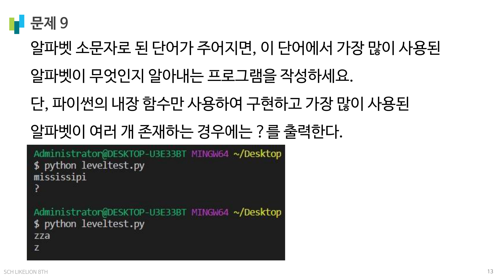

[10번 코드](https://github.com/LikeLionSCH/8th-Python-HW/blob/master/Level_Test_[06.21]/0621_Level_Test_10.py)
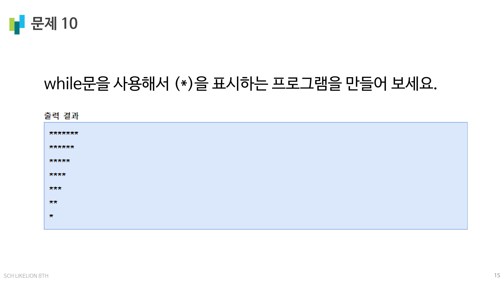

[11번 코드-1](https://github.com/LikeLionSCH/8th-Python-HW/blob/master/Level_Test_[06.21]/0621_Level_Test_11-1.py)
 
[11번 코드-2](https://github.com/LikeLionSCH/8th-Python-HW/blob/master/Level_Test_[06.21]/0621_Level_Test_11-2.py)
 
[11번 코드-3](https://github.com/LikeLionSCH/8th-Python-HW/blob/master/Level_Test_[06.21]/0621_Level_Test_11-3.py)
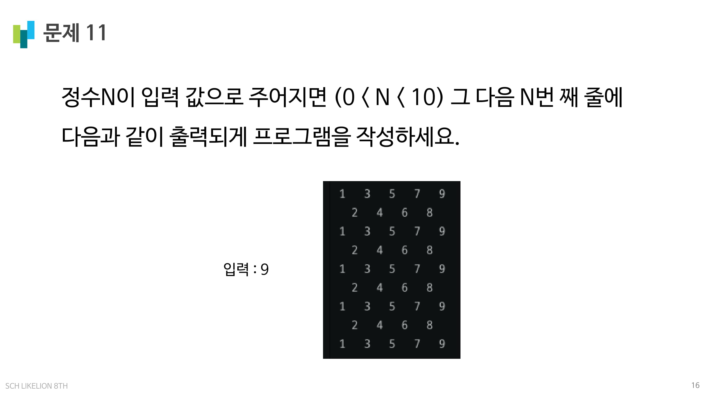

[12번 코드](https://github.com/LikeLionSCH/8th-Python-HW/blob/master/Level_Test_[06.21]/0621_Level_Test_12.py)
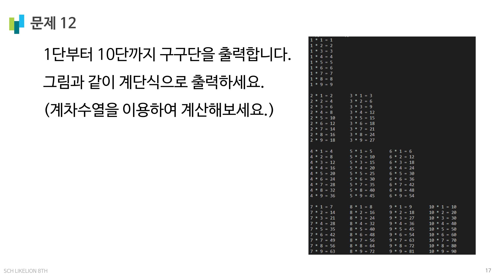

[13번 코드](https://github.com/LikeLionSCH/8th-Python-HW/blob/master/Level_Test_[06.21]/0621_Level_Test_13.py)
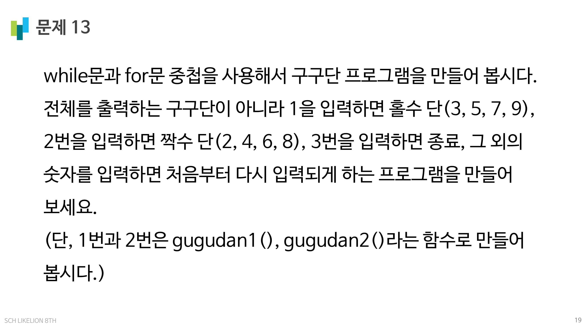
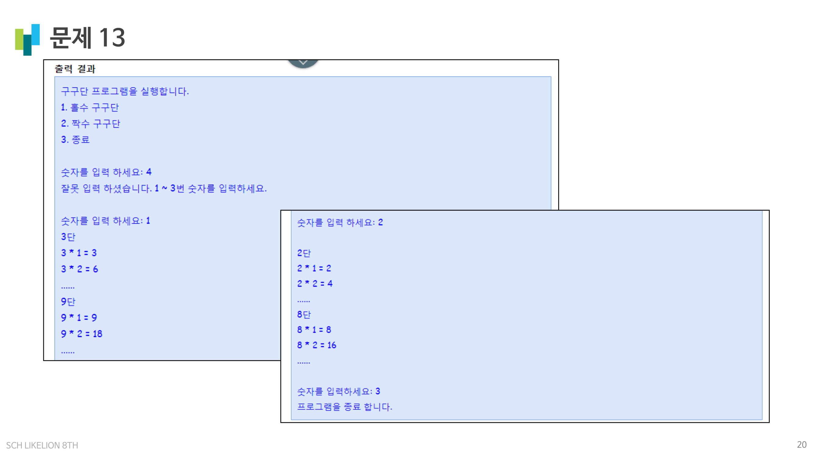

[14번 코드](https://github.com/LikeLionSCH/8th-Python-HW/blob/master/Level_Test_[06.21]/0621_Level_Test_14.py)
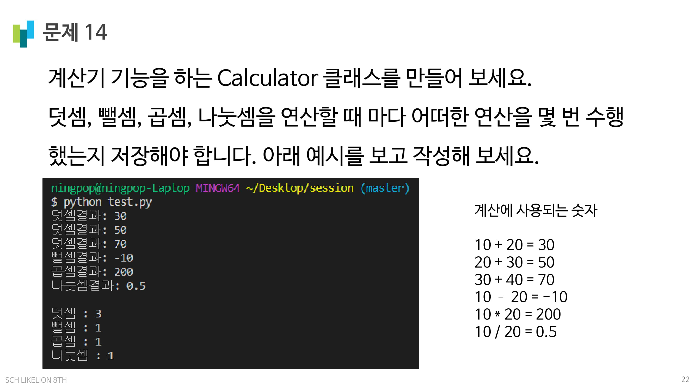