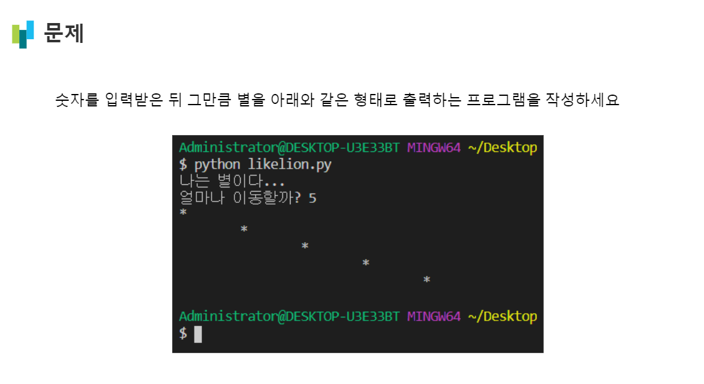
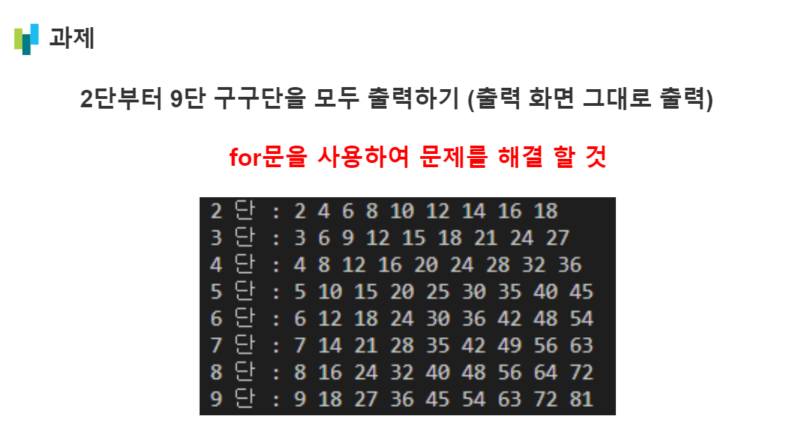
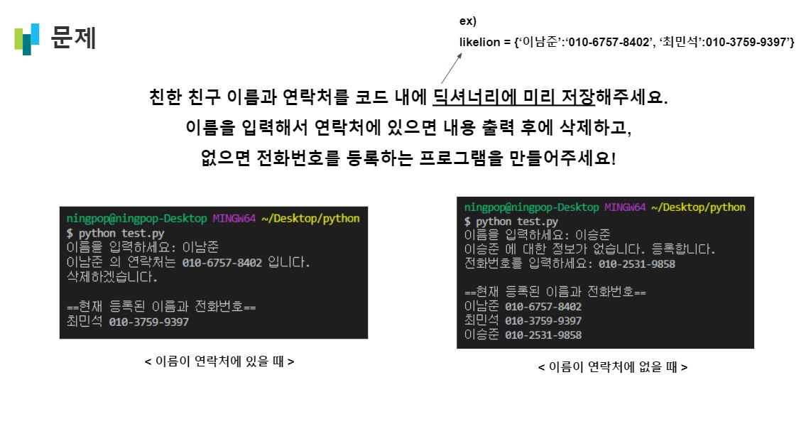
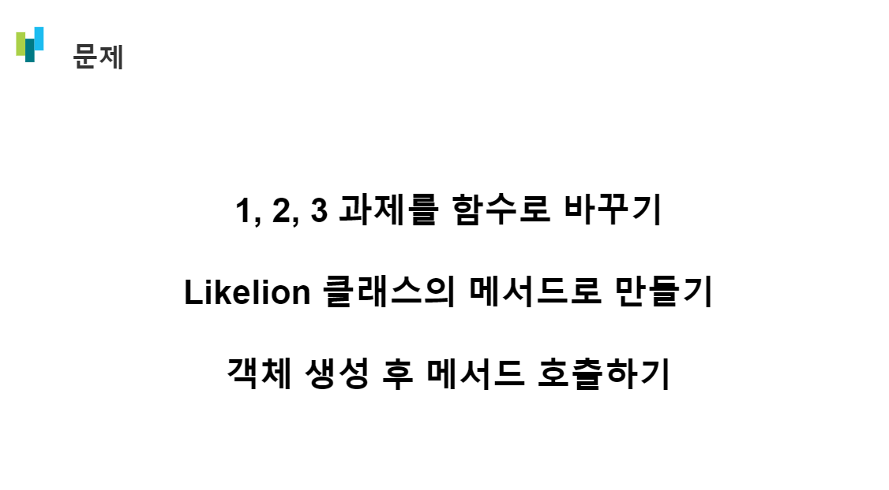

## Python 총정리

 

### 1번 (변수/상수, 입/출력, 조건/반복문) - 이승준 선생님
[1번 코드](https://github.com/LikeLionSCH/8th-Python-HW/blob/master/Summary_[06.15]/0615_hw1.py)

 
 

### 2번 (군집자료형1: 리스트/튜플) - 최민석 선생님
[2번 코드](https://github.com/LikeLionSCH/8th-Python-HW/blob/master/Summary_[06.15]/0615_hw2.py)

 
 

### 3번 (군집자료형2: 딕셔너리, 문자열의 인덱싱/슬라이싱) - 이남준 선생님
[3번 코드](https://github.com/LikeLionSCH/8th-Python-HW/blob/master/Summary_[06.15]/0615_hw3.py)

 
 

### 4번 (함수와 클래스) - 황상범 선생님
[4번 코드](https://github.com/LikeLionSCH/8th-Python-HW/blob/master/Summary_[06.15]/0615_hw4.py)
